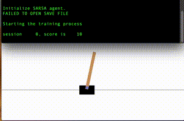
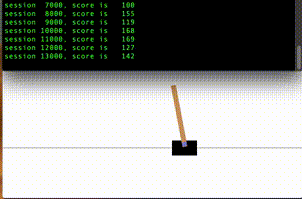
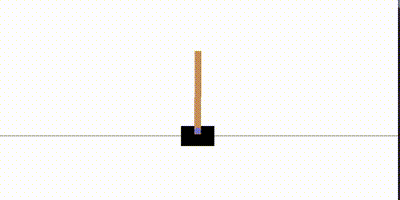
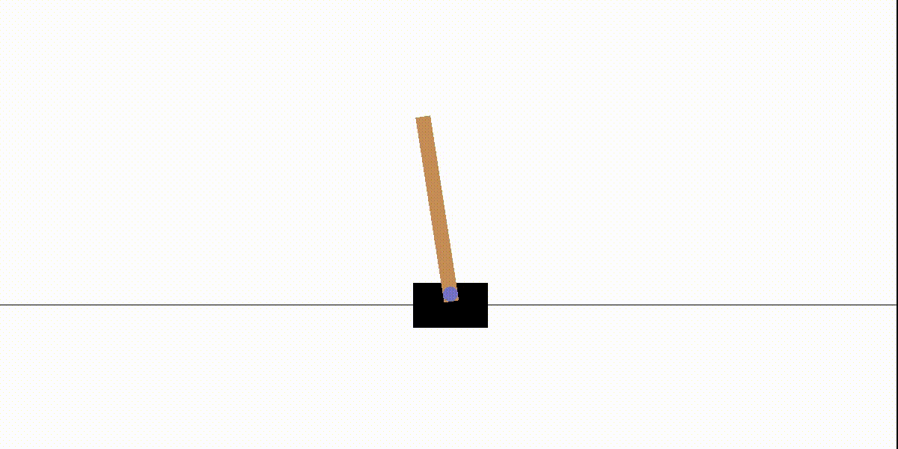

# Pole Cart 

Training an agent to balance a pole on a cart.


## Artificial Evolution

The agent 'learns' through artificial evolution.
```
python cartpole.py
```
This does converge consistantly within 400 generations x 50 simulations per generation = 20,000 simulations


The script stores the best agent in `cartpole_best.pickle`.  Delete that file if you want to start over.

The script takes some time to get here.  Here is a video of it struggling in the beginning


## SARSA

The agent uses sarsa state machine to learn how to control the cart.
```
python cartpole_sarsa.py
```
This doesn't converge in a reasonable timeframe.  After 20,000 simulations it still doesn't get consistantly above 300.

Start of training



After several iterations




## Q Learning with Tensorflow

The agent uses tensorflow and qlearning to learn a policy for controlling the cart.
```
python cartpole_nn.py
```
It is able to regularly converge on a solution within 5,000 simulations.

After training




# TPE Optimization

Use Bayesian Optimization on the neural net weights.
```
python cartpole_hp.py
```
It is able to converge on a solution within 120 simulations.

Here is how it progressed, with one demonstration shown per 30 simulations.




I used ffmpeg to create the above gif
```
ffmpeg -i smooth.mov -s 400x200 -pix_fmt rgb8 -r 30 -f gif - | gifsicle --optimize=3 --delay=3 > smooth.gif
```

Other environments of interest

https://gym.openai.com/envs/BipedalWalker-v2/

https://gym.openai.com/envs/CarRacing-v0/

