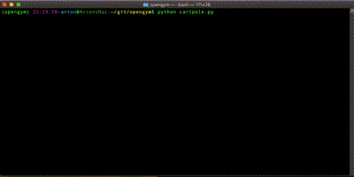
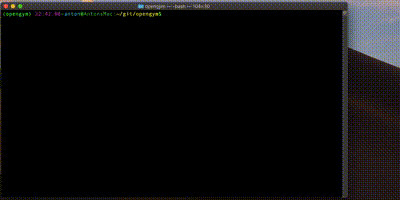

# Pole Cart 

Training an agent to balance a pole on a cart.

Currently the agent 'learns' through artificial evolution.

```
python cartpole.py
```



The script stores the best agent in `cartpole_best.pickle`.  Delete that file if you want to start over.

The script takes some time to get here.  Here is a video of it struggling in the beginning




I used ffmpeg to create the above gif
```
ffmpeg -i smooth.mov -s 400x200 -pix_fmt rgb8 -r 30 -f gif - | gifsicle --optimize=3 --delay=3 > smooth.gif
```